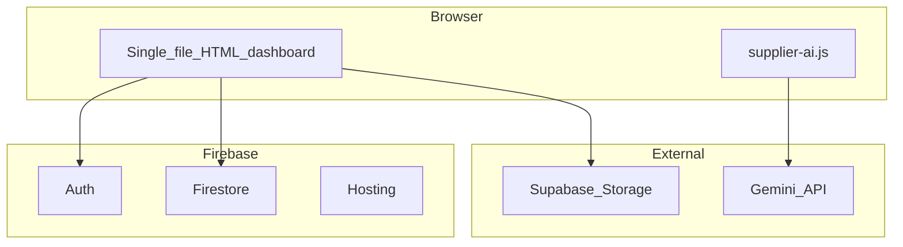

# B2B Fitout Dashboard — Reference for Orbit

Orbit is a structured reimplementation of the **B2B Fitout Dashboard** prototype (classroom/hall fitout: furniture, AV, lighting, sound). This document captures the original product’s **project phases**, **UI workflow**, **AI roadmap**, and **architecture**, and maps them to Orbit.

Original sources (external repo):

- `README.md` — stack, deploy, Gemini supplier search, AI feature roadmap
- `PROJECTS.md` — Projects section, P1–P6 stages, tabs, typical flow

---

## 1. Project delivery phases (P1–P6)

Business lifecycle stages for each fitout job. Shown as a stepper on project cards, dashboard rows, and the Overview tab.

| Stage | B2B label (RU) | Orbit i18n key | Meaning |
|-------|----------------|----------------|---------|
| **P1** | Определение типа проекта | `stages.p1` | Define project type (school, kindergarten, music school, etc.) |
| **P2** | Формирование списка наименований | `stages.p2` | Build the item list (furniture, equipment, AV, etc.) |
| **P3** | Техническое задание и смета | `stages.p3` | Technical specification + estimate |
| **P4** | Доставка и установка | `stages.p4` | Delivery and installation |
| **P5** | Финансовое закрытие | `stages.p5` | Financial close |
| **P6** | Подписки и постсервис | `stages.p6` | Subscriptions and post-service |

Constants: `artifacts/pm-app/src/lib/project-constants.ts` (`PROJECT_STAGES`).  
Translations: `artifacts/pm-app/src/i18n/locales/{en,ru,kk}.json` under `stages`.

### Typical project flow

1. Create project (usually at P1).
2. Open project → add tasks on kanban, assign owners.
3. Upload specs / ВОР under **Documents**.
4. Advance P2 → P3 as the item list and estimate firm up.
5. Use **Sourcing & Offer** when matching catalogs, finding suppliers, and building the commercial proposal.
6. Project auto-closes when all tasks are **Done**; reopens if work is added back.

---

## 2. UI workflow (project detail tabs)

Operational work areas inside a project — distinct from P1–P6 stages:

| B2B tab | Orbit tab | Implementation |
|---------|-----------|----------------|
| Задачи | Tasks | `TasksKanban` — todo → in progress → blocked → done |
| Документы | Documents | `DocumentsTab` + `project_documents` (metadata; file storage TBD) |
| Закупки / ИИ-поиск | Sourcing & Offer | `ProcurementTab` — 4-phase workflow (see below) |
| Обзор | Overview | `OverviewTab` — passport + budget utilisation |

Progress % is computed from tasks (`done / total`), not entered manually.

---

## 3. Sourcing & Offer workflow (Orbit)

The B2B prototype combined procurement with **AI supplier search** (`supplier-ai.js` + Gemini). Orbit models the full pre-procurement path explicitly:

| Phase | Status in Orbit | B2B equivalent |
|-------|-----------------|----------------|
| **Match items** | Implemented | Workspace KB: spec lists + multi-catalog match (`/projects/:id/match-run`) |
| **Find suppliers** | Implemented (basic) | Gemini search via `POST /kb/supplier-search` when `GEMINI_API_KEY` set |
| **Commercial offer** | Implemented (v1) | CSV export via `POST /projects/:id/commercial-offers/export` |
| **Procurement** | Planned | Orders, delivery tracking, purchase documents after КП approval |

UI: `artifacts/pm-app/src/components/procurement-tab.tsx`, `pages/catalogs.tsx`  
API: `artifacts/api-server/src/routes/kb.ts`, `sourcing.ts`

### Knowledge Base tables

`suppliers`, `catalog_sources`, `catalog_versions`, `catalog_products`, `spec_lists`, `spec_items`, `project_catalog_links`, `match_runs`, `match_results`, `commercial_offers`, `commercial_offer_lines` — see `lib/db/src/schema/knowledge-base.ts`.

---

## 4. AI / product roadmap (from B2B README)

Prioritized by dependency on external LLM cost, latency, and hallucination risk. Orbit should follow the same sequencing: deliver Stages 1–2 before heavy LLM integration.

### Stage 1 — Pure logic, no model

- Auto project status from task activity (all done → archived)
- Spec completeness checklist before contract signing
- Company-standard document formatting (template/docx generator)
- Auto comparison of estimates/kits with discrepancy report
- Object analytics (avg cost, price trends, top items)
- Deadline reminders (cron + rules)
- FGOS/SanPiN typical room kit recommendations (rules engine)

**Orbit status:** auto-close/reopen and task-based progress are implemented.

### Stage 2 — Classical algorithms / local models, no API cost

- Product name normalization (fuzzy match + synonym dictionary)
- Supplier price list parsing (PDF/Excel)
- Analog search when supplier lacks an item
- Project delay risk prediction (tabular ML on historical data)
- On-site voice input (local Whisper)

**Orbit status:** catalog matching (fuzzy) is implemented in the API matcher.

### Stage 3 — Needs LLM / vision

- Project knowledge-base Q&A (RAG)
- Procurement assistant for regulatory questions
- Draft defect acts from text/photo
- Draft supplier letters/notifications
- Photo recognition for delivery verification

**Orbit status:** not started. B2B prototype uses browser-side **Gemini + Google Search** for supplier search (free tier).

---

## 5. Architecture comparison

### B2B prototype

| Layer | B2B |
|-------|-----|
| Frontend | Single-file HTML, Firebase compat SDK |
| Auth | Firebase Auth |
| Data | Firestore (`projects`, `tasks`, `documents`, `team`) |
| Files | Supabase Storage (`project-documents`) |
| Deploy | Firebase Hosting |
| Supplier AI | `supplier-ai.js` → Gemini (browser) |

### Orbit

| Layer | Orbit |
|-------|-------|
| Frontend | React 19, Vite, Wouter, TanStack Query, Tailwind 4 |
| Auth | Clerk |
| Data | PostgreSQL + Drizzle ORM |
| API | Express 5, OpenAPI-first (Orval codegen) |
| Files | Document metadata in DB; blob storage TBD |
| Deploy | Vercel (see `docs/DEPLOY_VERCEL.md`) |
| Matching | Express API + fuzzy matcher |

---

## 6. B2B → Orbit feature matrix

| B2B concept | Orbit implementation | Notes |
|-------------|---------------------|-------|
| Project cards | `pages/projects.tsx` | `useListProjects({ withStats: true })` |
| Stage stepper P1–P6 | `StageStepper`, `PROJECT_STAGES` | Labels aligned via i18n |
| Passport fields | `projects` table, `EditProjectDialog` | |
| Managers | `project_managers` junction | Multi-select in edit dialog |
| Tasks kanban | `TasksKanban` | Includes blocked column |
| Documents | `DocumentsTab` | Storage not yet wired |
| Supplier AI / matching | `ProcurementTab` | Match items live; supplier AI planned |
| Overview | `OverviewTab` | Passport + budget + stage pipeline |
| Auto-close project | `syncProjectStatus()` | All tasks done → archived |
| Multilingual UI | react-i18next | en / ru / kk (ru default) |

---

## 7. What the B2B README does not define

- No dated sprint or milestone timeline
- No OpenAPI schema (Orbit adds this)
- No formal spec for the separate `catalog-matcher/` Python subproject in the B2B repo

The B2B “roadmap” is **feature prioritization by AI dependency**, not a calendar plan.
